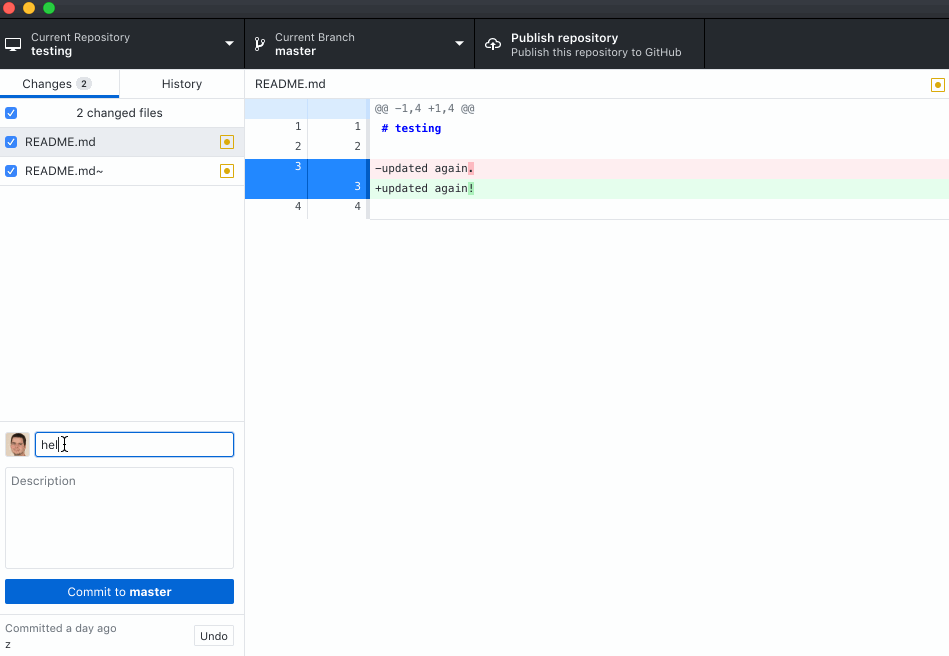
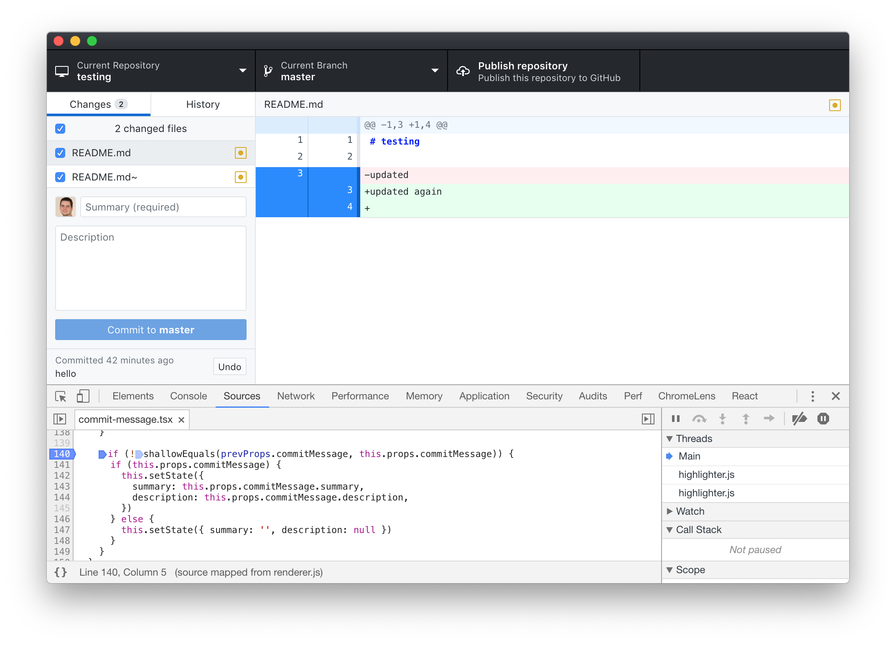

# Walkthrough: Fixing a Bug in GitHub Desktop

<p align="center">
  
</p>

Fixing a bug in a project the size of [GitHub Desktop](https://code.visualstudio.com/) might seem
overwhelming at first. The following is a so-called ["good-first-experience"](https://blog.humphd.org/experiments-with-good-first-experience/) walkthrough of how one might solve a real bug. It is meant as
a learning exercise for my open source students at Seneca, or anyone else that is
interested in getting started fixing bugs in large projects. Other similar walkthroughs
are available for [Microsoft VSCode](https://github.com/humphd/vscode/tree/good-first-experience-issue-42726#walkthrough-fixing-a-bug-in-visual-studio-code) and
the [Brave desktop web browser](https://github.com/humphd/browser-laptop/tree/good-first-experience-issue-10554#walkthrough-fixing-a-bug-in-the-brave-browser).

During this walkthrough we will discuss and/or do the following:

* Find a suitable bug to work on in GitHub Desktop
* Reproduce the bug in our own build
* Use `git bisect` to determine when the bug was introduced
* Use the Chrome DevTools to debug and understand the code
* Experiment with a possible fix for the bug
* Work with the GitHub maintainers to find an optimal solution 

NOTE: I am doing this work in an old branch of [GitHub Desktop](https://github.com/desktop/desktop), and
modifying things directly in the repo so that you can clone and checkout my branch if you want
to play along at home.  To do so:

```
git clone https://github.com/humphd/desktop.git
cd desktop
git checkout good-first-experience-issue-6390
```

Next, spend some time reading [CONTRIBUTING.md](.github/CONTRIBUTING.md) and the project's extensive
[developer documentation](docs). Pay special attention to the information on [setup, building, and debugging](docs/contributing/setup.md).

The remainder of this walkthrough assumes that you know how to do the following:

* install dependencies using `yarn`
* build the app using `yarn build:dev`
* run your built editor using `yarn start`

## Finding a Bug

At the time of writing, there are [510 open issues](https://github.com/desktop/desktop/issues) in the GitHub Desktop repo. Finding a bug to start with can be hard.  Let's begin by narrowing things down, using the project's extensive set of [Labels](https://github.com/desktop/desktop/labels).

Not all projects triage their issues using labels.  Those that do give us some useful clues about how to
navigate through the list of open bugs, feature requests, etc.  GitHub Desktop not only uses labels, but
also [documents their process](docs/process/issue-triage.md), and [discusses how to interpret the set of labels in use](docs/process/labels.md).  According to these docs, [some of the labels we might want to consider include](docs/process/labels.md#external-contributions):

* [`good first issue`](https://github.com/desktop/desktop/labels/good%20first%20issue)
* [`help wanted`](https://github.com/desktop/desktop/labels/help%20wanted)

At the time of writing, there are 2 issues marked `good first issue`, and 119 marked `help wanted`.
Because there are only 2 with `good first issue`, I'm going to leave those for other, newer developers.  If you're reading this and you are in fact a new open source developer, I'd suggest you start with one of these.  However, for our current walkthough, let's focus on the `help wanted` label instead. 

While examining the labels used in the project, I also noticed a number of other interesting ones:

* [`priority-2`](https://github.com/desktop/desktop/labels/priority-2): Bug that affects more than a few users in a meaningful way but doesn't prevent core functions (17) 
* [`priority-3`](github.com/desktop/desktop/labels/priority-3): Bugs that affect small number of users and/or relatively cosmetic in nature (116)
* [`bug`](https://github.com/desktop/desktop/labels/bug): Confirmed bugs or reports that are very likely to be bugs” (126)

Each of these three labels points to issues that might be a good fit with my goal of finding and fixing a bug in the project.  First, the `priority-2` and `priority-3` point to issues that are important enough to want to fix, but not so critical that I'll be under pressure to make a fix (i.e., a maintainer would be better suited to the task).  Second, the `bug` label identifies issues that are confirmed bugs, and require me to inspect and debug existing code vs. write new code.  We're often excited at the idea of writing new features in a project, but I'd suggest that fixing small, existing bugs is a better place to begin.  Doing so will help you understand the code, project processes, and introduce you to the community.  After doing a few fixes, maybe you'll be ready to tackle a feature.

In addition to these, I also noticed a number of labels I’m actively going to avoid:

* [`priority-1`](https://github.com/desktop/desktop/labels/priority-1) Major bug affecting large population and inhibiting their work
* [`time-sensitive`](https://github.com/desktop/desktop/labels/time-sensitive): Pull Requests where reviews need to happen in a timely manner
* [`needs-design-input`](https://github.com/desktop/desktop/labels/needs-design-input): Issues that require design input from the core team before the work can be started

All of these labels point at things with time pressure demands, dependencies on work from other team members, etc. We'll be happier working on something smaller, and at a slower pace as we get familiar with the project, and these labels signal areas we probably want to avoid at first.

Given everything we've learned above, we can look for potential issues using the following query::

https://github.com/desktop/desktop/issues?utf8=%E2%9C%93&q=is%3Aopen+label%3Abug+label%3A%22help+wanted%22

At the time of writing, this returned 43 issues possible issues.  Of these, all but one was a `priority-2` or `priority-3`, which is perfect.  We can further narrow this down by [searching for issues with no one assigned](https://help.github.com/en/articles/searching-issues-and-pull-requests#search-by-missing-metadata) (i.e., `no:assignee`), which returns this issue:

https://github.com/desktop/desktop/issues/6390 - Clicking "Undo button doesn't populate summary field

Let's try to figure out what is causing this bug.

## Reproducing the Bug

Fixing this bug is going to be easiest if we can reproduce it locally.  While this isn't always possible, when
it is, the process of debugging is greatly accelerated.  Let's see if we can reproduce it in our own build.

The person who filed the bug left some important clues:

* the bug involves creating a commit, hitting `Undo`, and the commit summary and description fields in the UI getting lost
* however, the bug doesn't always happen, it seems to be "random"
* the bug seems to have started happening recently, maybe in the past ["2 weeks"](https://github.com/desktop/desktop/issues/6390#issue-389558925) or ["could have been caused by a recent update"](https://github.com/desktop/desktop/issues/6390#issuecomment-446081709)
* the reporter is using version 1.5.0 of the app

Further down in the issue's comments, [one of the maintainers suggests](https://github.com/desktop/desktop/issues/6390#issuecomment-446297341) that problem might be related to one of two pull requests: [#6018](https://github.com/desktop/desktop/pull/6018) or [#6037](https://github.com/desktop/desktop/pull/6037).  This same contributor is [later able to successfully reproduce the bug](https://github.com/desktop/desktop/issues/6390#issuecomment-446301821), and also adds some steps to reproduce:

1. Change some file(s) in a repo being using with GitHub Desktop
1. In GitHub Desktop, add a commit Summary of `hello`
1. Create a commit
1. Click Undo, notice state of the Summary input field (should be `hello` again)
1. Repeat previous commit/undo steps, noticing Summary input field after each Undo (should be `hello`)

These are exactly what we need, replacing the seemingly random behaviour into a simple manual test we can try.  After we build and run our local version of the app, we can clearly see the bug in action:


## Finding the Related Code

Now that we can successfully recreate the bug, it's time to try and locate the code that causes the issue. Where to begin? GitHub Desktop is a large program ([~160K lines of code written by 154 people](https://www.openhub.net/p/github-desktop)), and we don't (yet) know the code.  Should we dive in and just try to figure out where the code controlling this part of the app lives?  We could, and that's often your only option. However, in this case we have another tool available to us.

### Finding a Regression Window

Recall that the issue we're examining includes this:

> Before, whenever I clicked the "Undo" button to undo a commit, the summary and description fields get populated with the description of that commit. But now, they don't always get populated.

Our bug is one where things used to work properly, and have now started failing intermittently.  We often refer to such a bug as a [*regression*](https://en.wikipedia.org/wiki/Software_regression), because our program has *regressed* (gone backwards) in functionality instead of *progressing*.

In cases where code in a git repository has regressed, we can try using [`git bisect`](https://git-scm.com/book/en/v2/Git-Tools-Debugging-with-Git) to automate search through old commits in order to find the cause of our bug (i.e., the commit).

The concept is simple: things no longer work as expected, therefore, some change to the code must have broken things.  In the case of git, every change is a commit, and git knows about all 20K+ commits in the GitHub Desktop repository.  One of them introduced a change we need to correct.  But which one?

To answer this question, we're going to have to begin by finding a *regression window*: two points in time that represent a) the code working as expected; and b) the code failing.

We already have two known failing commits: our current position, and also the released version 1.5.0, which the bug reporter says he was using.  The set of [release tags associated with the project](https://github.com/desktop/desktop/releases) is a useful way to find our regression window.

The [1.5.0](https://github.com/desktop/desktop/releases/tag/release-1.5.0) release happened on Nov 13, 2018, and represents the first "failed" commit.  The bug reporter said that things worked in a previous release, and the last major release before 1.5.0 was [1.4.3](https://github.com/desktop/desktop/releases/tag/release-1.4.3) on Oct 18, 2018.  When searching for the last-known-good commit in a regression window, don't worry too much about staying close to the failed commit: the bug might have been introduced a day, week, month, or year ago.  We can't tell at this point.  We'll let `git bisect` help us quickly jump across these commits.

Let's see if version 1.4.3 has this bug.  To do that, we need to checkout the code from that release, rebuild, and test for our bug:

```
$ git checkout release-1.4.3
$ yarn
$ yarn build:dev
$ yarn start
```



It looks like version 1.4.3 did not have the bug, and sometime between 1.4.3 and 1.5.0 it got introduced.  We have our regression window, and can now use `git bisect`.

### Using `git bisect` to Debug

Armed with a start and end range in git, we can begin the work of figuring out which commit introduced the bug.  In our regression range there were 26 days and 601 commits, with [~90K lines of code changed in 272 files (78,835 additions and 90,732 deletions)](https://github.com/desktop/desktop/compare/release-1.4.3...release-1.5.0).  That's way too much code to go through manually.

Instead, we'll get git to do a binary search through these commits to find the first bad one.  We should first point out that git doesn't understand our code.  It doesn't know the difference between a good or bad commit.  We'll have to help it assess whether a commit is good or bad as we do the search, but git can greatly help us by skipping past huge numbers of commits.

To start the process, we tell git to begin a bisect and inform git of our regression window, using the release tags for 1.4.3 and 1.5.0:

```
$ git bisect start
$ git checkout release-1.4.3
$ git bisect good
$ git checkout release-1.5.0
$ git bisect bad
```

Another, more condensed way to do this would have been:

```
$ git bisect start release-1.5.0 release-1.4.3
```

In either case, git begins a bisect between the good and bad commits and immediately jumps to the midpoint of the two: if we know that one end of the range is good, and the other bad, the commit in the middle will either be good or bad, and allow us to ignore one-half of the commits on either side:

```
Bisecting: 318 revisions left to test after this (roughly 8 steps)
[8e3dbb0262fc9dd420ea1843ec9d63600dd988f4] Merge branch 'clearer-actions' of https://github.com/desktop/desktop into clearer-actions
```

Here git checks out the `8e3dbb0262fc9dd420ea1843ec9d63600dd988f4` commit, and tells us that there are 318 commits after this to test, which will be done within ~8 repetitions of this process.  We need to re-install our dependencies (they might be different for each commit), re-build the code, run the app and try to reproduce the bug manually.  If we find the bug we mark the commit as bad (`git bisect bad`), otherwise good (`git bisect good`).  Based on our answer, git will divide what's left in half and ask us repeat the process, until it lands on the first commit to introduce the bug.

<details>
<summary>A slightly annotated log of the entire process is available here.</summary>
Bisecting: 318 revisions left to test after this (roughly 8 steps)
[8e3dbb0262fc9dd420ea1843ec9d63600dd988f4] Merge branch 'clearer-actions' of https://github.com/desktop/desktop into clearer-actions

(8e3dbb026 Tues Oct 30, 2018 9:42) $ git bisect good
Bisecting: 160 revisions left to test after this (roughly 7 steps)
[cdc900023f70a6f024888aad0282cb03b866f309] Merge pull request #6074 from desktop/tidy-up-status-tests

(cdc900023 Thur Nov 1, 2018 10:36) $ git bisect bad
Bisecting: 78 revisions left to test after this (roughly 6 steps)
[85b830dd2d860eec6c5b21a499cf7b3a4f474c00] Merge pull request #5995 from desktop/leave-errors-up-to-the-error-handlers

(85b830dd2 Thurs Oct 25, 2019 8:58) $ git bisect good
Bisecting: 39 revisions left to test after this (roughly 5 steps)
[bb6d035ccc4fa17cd6584132fe19695ea9124df7] state when banner is shown

(bb6d035cc Tues Oct 30, 2018 12:18) $ git bisect good
Bisecting: 20 revisions left to test after this (roughly 4 steps)
[380e6bf8db0411ecec180df258056db9165bc86c] Merge pull request #6059 from desktop/refresh-status-after-abort

(380e6bf8d Thurs Nov 1, 2018 8:00) $ git bisect good
Bisecting: 10 revisions left to test after this (roughly 3 steps)
[ed0ad441792bd7342942364602eab949606c2bcc] remove contextualCommitMessage

(ed0ad4417 Tues Oct 30, 2018 11:17) $ git bisect good
Bisecting: 5 revisions left to test after this (roughly 3 steps)
[abf151ef998a53ff06971eaa54fa0ce63b1fec5c] move status tests away from chai

(abf151ef9 Thus Nov 1, 2018 13:35) $ git bisect bad
Bisecting: 2 revisions left to test after this (roughly 1 step)
[c86407e0058a8076ece693f5458f4acda71dff59] Merge pull request #6044 from desktop/alternative-merge-style-fix

(c86407e00 Thu Nov 1, 2018 8:01) $ git bisect good
Bisecting: 0 revisions left to test after this (roughly 1 step)
[0992d33d1207d8312e115c7064bbd6c651f4a629] Merge pull request #6037 from desktop/clear-commit-message

(0992d33d1 Thu Nov 1, 2018 12:19) $ git bisect bad
Bisecting: 0 revisions left to test after this (roughly 0 steps)
[6b9ca6cb7cdc12d6bdda4285874c1d4d813c3e61] use shallowEquals

(6b9ca6cb7 Wed Oct 31, 2018 9:32) $ git bisect bad
6b9ca6cb7cdc12d6bdda4285874c1d4d813c3e61 is the first bad commit
commit 6b9ca6cb7cdc12d6bdda4285874c1d4d813c3e61
Date:   Wed Oct 31 09:32:08 2018 -0700

    use shallowEquals

:040000 040000 a48c9be60a35ddd83f7783fdfdd024139631ea9b f49d66e116a9a59162d89f865c6086895bc2cc0a M	app
</details>

In the end, the process took 10 steps and ended on commit [6b9ca6cb7cdc12d6bdda4285874c1d4d813c3e61](https://github.com/desktop/desktop/commit/6b9ca6cb7cdc12d6bdda4285874c1d4d813c3e61) from Oct 31, 2018.

We can exit out of our bisect session and return to our original commit/branch:

```
$ git bisect reset
```

### Understanding a breaking change

Having determined the first bad commit, we can now try to glean some information that might help us in fixing the bug.  What can we learn from this commit?

First we learn who was involved in making the change.  This is useful because it gives us the name/email of a person to whom we could talk.  Maybe our research is done now, and we want to make this person aware of what we discovered.  Or maybe as we start working on a fix, we’ll have questions. Finally, we might want a review, and this is someone who knows the code.

Second, we learn which file(s), and line(s) of code are involved.  In this case the [change is quite small](https://github.com/desktop/desktop/commit/6b9ca6cb7cdc12d6bdda4285874c1d4d813c3e61#diff-89f50300b76ac999f8cf40ef627bfe27R).  Also, the relationship between our bug and the code is quite high.  That’s good, since it might mean we can fix it.  If the change had been part of a massive refactor of the code, we might decide to let someone else work on this.  This process should also help to underscore the value of making small commits, since smaller commits mean that it's easier to trace back to the introduction of a bug.

Third, we learn which [Pull Request this was part of: 6037](https://github.com/desktop/desktop/pull/6037).  This is one small change (commit) in a larger change ([11 commits](https://github.com/desktop/desktop/pull/6037/commits)).  By connecting back to a PR, we also get access to even more people who know this code, in particular the reviewer.  We also have discussion of what the PR is about, as well as associated Issues: [#6049](https://github.com/desktop/desktop/issues/6049) and [#6013](https://github.com/desktop/desktop/pull/6013).  All of this together provides an excellent set of background reading, which we can use to inform our work in understanding the cause of the bug.

## Debugging using DevTools

At this point we have enough information to move on to the next phase of our work.  We've determined that the change in ... introduced the bug, and reading the diff in that commit it's clear that [`app/src/ui/changes/commit-message.tsx`](app/src/ui/changes/commit-message.tsx) and `componentDidUpdate()` are involved:

```diff
@@ -22,6 +22,7 @@ import { Octicon, OcticonSymbol } from '../octicons'
 import { ITrailer } from '../../lib/git/interpret-trailers'
 import { IAuthor } from '../../models/author'
 import { IMenuItem } from '../../lib/menu-item'
+import { shallowEquals } from '../../lib/equality'

@@ -132,17 +133,14 @@ export class CommitMessage extends React.Component<
        ),
      })
    }
-    if (prevProps.commitMessage !== this.props.commitMessage) {
+    if (!shallowEquals(prevProps.commitMessage, this.props.commitMessage)) {
      if (this.props.commitMessage) {
        this.setState({
          summary: this.props.commitMessage.summary,
          description: this.props.commitMessage.description,
        })
      } else {
-        this.setState({
-          summary: '',
-          description: null,
-        })
+        this.setState({ summary: '', description: null })
      }
    }
  }
```

A switch has been made from using `!==` to `shallowEquals()`.  This `if` check seems to guard access to the commit's `summary` and `description` state being updated.  It would be interesting to observe this happening in the debugger when it failed.

Since we're interested in trying to fix the bug, we'll switch back to the most current version

We can use the [Chrome DevTools](https://developers.google.com/web/tools/chrome-devtools/) to debug our app, as [discussed in the docs](https://github.com/desktop/desktop/blob/development/docs/contributing/setup.md#debugging).  After running our app, in the DevTools we can switch to the `Sources` tab and then use `Ctrl+p`/`Cmd+p` to find the [`app/src/ui/changes/commit-message.tsx`](app/src/ui/changes/commit-message.tsx) file and our `shallowEquals()` check on line 140. 



########################################################

GitHub Desktop is an open source [Electron](https://electron.atom.io)-based
GitHub app. It is written in [TypeScript](http://www.typescriptlang.org) and
uses [React](https://facebook.github.io/react/).

