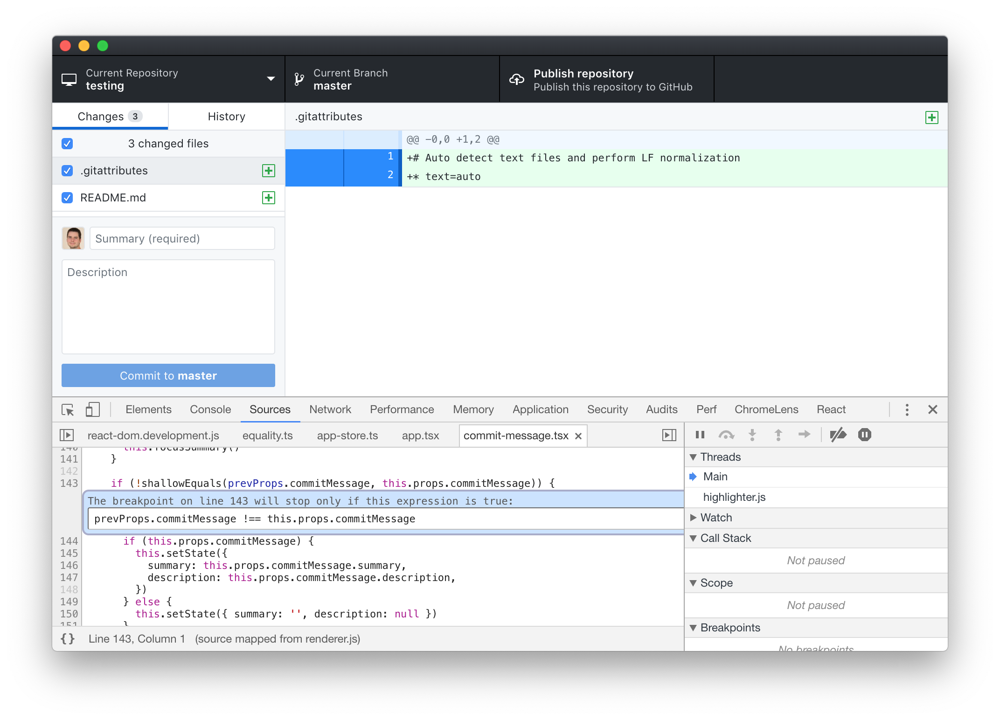

# Walkthrough: Fixing a Bug in GitHub Desktop

<p align="center">
  
</p>

## Overview

The following is a so-called ["good-first-experience"](https://blog.humphd.org/experiments-with-good-first-experience/) walkthrough designed to help you learn how to solve real bugs in an open source project. It is meant as
a learning exercise for students in my open source courses at Seneca College, or anyone else that is
interested in getting started fixing bugs in large projects.

Other similar walkthroughs
are available for working on bugs in [Microsoft VSCode](https://github.com/humphd/vscode/tree/good-first-experience-issue-42726#walkthrough-fixing-a-bug-in-visual-studio-code) and
the [Brave desktop web browser](https://github.com/humphd/browser-laptop/tree/good-first-experience-issue-10554#walkthrough-fixing-a-bug-in-the-brave-browser).

## Introduction

[GitHub Desktop](https://desktop.github.com/) is an open source [Electron](https://electron.atom.io)-based
GitHub app. It is written in [TypeScript](http://www.typescriptlang.org) and
uses [React](https://facebook.github.io/react/).

Over the past few semesters I've had a number of my open source students fix bugs in GitHub Desktop, and each time been impressed with how the maintainers have treated these new contributors.  I was also encouraged by a [recent interview](https://github.blog/2019-02-15-maintainer-spotlight-william-shepherd/) with one of the GitHub Desktop maintainers, [William Shepherd](https://github.com/iAmWillShepherd): 

> "My team is always open to receiving contributions. We are looking for kind people who are empathetic and have a collaborative mindset. We are open to all types of contributions, but we are very interested in getting more people from non-technical backgrounds involved. A few of the things that we’d love help with are:"
>
>- Improvements to project documentation
>- Making the application more accessible
>- Assuring quality of the application
>- Improvements to our design
>- Identifying and reporting pain points in the application
>- Bug fixes

It's fantastic to see a project with this approach and level of commitment to engaging with new contributors.
As a result I decided to base my next open source bug fix walkthrough on GitHub Desktop, in order to help more of my students (and other developers) also get involved in the project.

## Goals

During this walkthrough we will discuss the following:

* How to find a suitable bug to work on in GitHub Desktop
* How to reproduce the bug in our own build
* Using `git bisect` to find a regression window for our bug
* Use the Chrome DevTools to debug and understand the code
* Experiment with a possible fix for the bug
* Work with the GitHub maintainers to find an optimal solution 

NOTE: I am doing this work in an old branch of [GitHub Desktop](https://github.com/desktop/desktop), and
modifying things directly in the repo so that you can clone and checkout my branch if you want
to play along at home.  To do so:

```
git clone https://github.com/humphd/desktop.git
cd desktop
git checkout good-first-experience-issue-6390
```

Next, spend some time reading [CONTRIBUTING.md](.github/CONTRIBUTING.md) and the project's extensive
[developer documentation](docs). Pay special attention to the information on [setup, building, and debugging](docs/contributing/setup.md).

The remainder of this walkthrough assumes that you have read the docs above, and know how to build and run the code.  The project uses [yarn](https://yarnpkg.com/en/docs/getting-started) to manage dependencies and run build scripts, specifically:

* install dependencies using `yarn`
* build the app using `yarn build:dev`
* run your built editor using `yarn start`

## Finding a Bug

At the time of writing, there are [510 open issues](https://github.com/desktop/desktop/issues) in the GitHub Desktop repo. Finding your first bug can seem hard.  What if you aren't an expert in the technologies, languages, or tools being used?  What if you don't understand all the code?

In this walkthrough I'm going to intentionally work on a bug in an area of code that that I don't fully understand (front-end React).  We'll see how far we can get with imperfect knowledge of the code, and hopefully build some confidence along the way. 

Let's begin by narrowing things down, using the project's extensive set of [labels](https://github.com/desktop/desktop/labels).  Not all projects triage their issues using labels.  Those that do give us some useful clues about how to navigate through the list of open bugs, feature requests, etc.  GitHub Desktop not only uses labels, but also [documents their process](docs/process/issue-triage.md), and [discusses how to interpret the set of labels in use](docs/process/labels.md).  According to these docs, [some of the labels we might want to consider include](docs/process/labels.md#external-contributions):

* [`good first issue`](https://github.com/desktop/desktop/labels/good%20first%20issue)
* [`help wanted`](https://github.com/desktop/desktop/labels/help%20wanted)

At the time of writing, there are 2 issues marked `good first issue`, and 119 marked `help wanted`.
Because there are only 2 with `good first issue`, I'm going to leave those for other, newer developers.  If you're reading this and you are in fact a new open source developer, I'd suggest you start with one of these.  However, for our current walkthough, let's focus on the `help wanted` label instead. 

While examining the labels used in the project, I also noticed a number of other interesting possibilities:

* [`priority-2`](https://github.com/desktop/desktop/labels/priority-2): Bug that affects more than a few users in a meaningful way but doesn't prevent core functions (17) 
* [`priority-3`](github.com/desktop/desktop/labels/priority-3): Bugs that affect small number of users and/or relatively cosmetic in nature (116)
* [`bug`](https://github.com/desktop/desktop/labels/bug): Confirmed bugs or reports that are very likely to be bugs (126)

Each of these three labels points to issues that might be a good fit with my goal of finding and fixing a bug in the project as a new contributor.

First, the `priority-2` and `priority-3` point to issues that are important enough to want to fix, but not so critical that I'll be under pressure to make a fix (i.e., a maintainer would be better suited to the task).

Second, the `bug` label identifies issues that are confirmed bugs, and require me to inspect and debug existing code vs. write new code.  We're often excited at the idea of writing new features in a project, but I'd suggest that fixing small, existing bugs is a better place to begin.  Doing so will help you understand the code, project processes, and introduce you to the community.  After doing a few fixes, maybe you'll be ready to tackle a feature.

In addition to these, I also noticed a number of labels I’m actively going to avoid:

* [`priority-1`](https://github.com/desktop/desktop/labels/priority-1) Major bug affecting large population and inhibiting their work
* [`time-sensitive`](https://github.com/desktop/desktop/labels/time-sensitive): Pull Requests where reviews need to happen in a timely manner
* [`needs-design-input`](https://github.com/desktop/desktop/labels/needs-design-input): Issues that require design input from the core team before the work can be started

All of these labels point at things with time pressure demands, dependencies on work from other team members, etc. We'll be happier working on something smaller, and at a slower pace as we get familiar with the project, and these labels signal areas we probably want to avoid at first.

Given everything we've learned above, we can look for potential issues using the following query:

https://github.com/desktop/desktop/issues?utf8=%E2%9C%93&q=is%3Aopen+label%3Abug+label%3A%22help+wanted%22

At the time of writing, this returned 43 possible issues.  Of these, all but one was a `priority-2` or `priority-3`, which is perfect.  We can further narrow this down by [searching for issues with no one assigned](https://help.github.com/en/articles/searching-issues-and-pull-requests#search-by-missing-metadata) (i.e., `no:assignee`), which returns this issue:

https://github.com/desktop/desktop/issues/6390 - **Clicking "Undo" button doesn't populate summary field**

Let's try to figure out what is causing this bug.

## Reproducing the Bug

Fixing this bug is going to be easiest if we can reproduce it locally.  First, the bug may not exist anymore (maybe it was fixed and the issue never closed?)  If it does still exist, the process of debugging it will be greatly accelerated if we can reproduce it on our own computer.  Let's see if we can reproduce it in our own build.

The person who filed the bug left some important clues:

* the bug involves creating a commit, hitting `Undo`, and the commit summary and description fields in the UI getting lost
* however, the bug doesn't always happen, it seems to be "random"
* the bug seems to have started happening recently, maybe in the past ["2 weeks"](https://github.com/desktop/desktop/issues/6390#issue-389558925) or ["could have been caused by a recent update"](https://github.com/desktop/desktop/issues/6390#issuecomment-446081709)
* the reporter is using version 1.5.0 of the app

Further down in the issue's comments, [one of the maintainers suggests](https://github.com/desktop/desktop/issues/6390#issuecomment-446297341) that problem might be related to one of two pull requests: [#6018](https://github.com/desktop/desktop/pull/6018) or [#6037](https://github.com/desktop/desktop/pull/6037).  This same contributor is [later able to successfully reproduce the bug](https://github.com/desktop/desktop/issues/6390#issuecomment-446301821), and also adds some steps to reproduce:

1. Change some file(s) in a repo being using with GitHub Desktop
1. In GitHub Desktop, add a commit Summary of `hello`
1. Create a commit
1. Click Undo, notice state of the Summary input field (should be `hello` again)
1. Repeat previous commit/undo steps, noticing Summary input field after each Undo (should be `hello`)

These are exactly what we need, replacing the seemingly random behaviour with a simple manual test we can try ourselves.  After we build and run our local version of the app, we can clearly see the bug in action:


> NOTE: I've created a new, mostly empty repository (`git init`) with a `README.md` file, and opened that in the app for testing.

## Finding the Related Code

Now that we can successfully recreate the bug, it's time to try and locate the code that causes the issue. Where to begin? GitHub Desktop is a large program ([~160K lines of code written by 154 people](https://www.openhub.net/p/github-desktop)), and we don't (yet) know the code.  Should we dive in and just try to figure out where the code controlling this part of the app lives?  We could, and this was our strategy in the [VSCode walkthrough](https://github.com/humphd/vscode/tree/good-first-experience-issue-42726#finding-the-related-code). However, in this case we have another tool available to us in the form of `git bisect`.

### Finding a Regression Window

Recall that the original issue filed includes this bit of information:

> Before, whenever I clicked the "Undo" button to undo a commit, the summary and description fields get populated with the description of that commit. But now, they don't always get populated.

Our bug is one where things used to work properly, and have now started failing intermittently.  We often refer to such a bug as a [*regression*](https://en.wikipedia.org/wiki/Software_regression), because our program has *regressed* (gone backwards) in functionality instead of *progressing*.

In cases where code in a git repository has regressed, we can try using [`git bisect`](https://git-scm.com/book/en/v2/Git-Tools-Debugging-with-Git) to automate searching through old commits in order to find the cause of our bug (i.e., the commit).

With a regression, our assumption is as follows: our program used to work, but now fails in some new way.  We assume that some change to the code must have introduced the failing behaviour.  In the case of git, every change is a commit, and git knows about all [20K+ commits in the GitHub Desktop repository](https://github.com/desktop/desktop/commits/development).  One of them introduced a change we need to correct.  But which one?

To answer this question, we're going to have to begin by finding a *regression window*, that is, two points in time (i.e., two commits) that represent a) the code working as expected; and b) the code failing.

We already have two known failing commits: our current position, and also the released version 1.5.0, which the bug reporter says he was using.  The set of [release tags associated with the project](https://github.com/desktop/desktop/releases) is a useful way to hunt for our regression window.

The [1.5.0](https://github.com/desktop/desktop/releases/tag/release-1.5.0) release happened on Nov 13, 2018, and represents a known "failing" commit.  The bug reporter said that things worked in a previous release, and the last major release before 1.5.0 was [1.4.3](https://github.com/desktop/desktop/releases/tag/release-1.4.3) on Oct 18, 2018.  When searching for the last-known-good commit in a regression window, don't worry too much about staying close to the failed commit: the bug might have been introduced a day, week, month, or year ago.  We can't tell at this point.  We'll let `git bisect` help us quickly jump across these commits.

Let's see if version 1.4.3 has this bug.  To do that, we need to checkout the code from that release, rebuild, and test for our bug:

```
$ git checkout release-1.4.3
$ yarn
$ yarn build:dev
$ yarn start
```


It looks like version 1.4.3 did not have the bug.  This means that at some point between release 1.4.3 and 1.5.0 it was introduced.  Now we have our regression window, and can use `git bisect` to find the commit responsible for the bug.

### Using `git bisect` to Debug

Armed with a start and end range in git, we can begin the work of figuring out which commit introduced the bug.  In our regression range there are 26 days and 601 commits, with [~90K lines of code changed in 272 files (78,835 additions and 90,732 deletions)](https://github.com/desktop/desktop/compare/release-1.4.3...release-1.5.0).  That's way too much code to go through manually!

Instead, we'll get git to do a binary search through these commits to find the first bad one.  We should first point out that git doesn't understand our code.  It doesn't know the difference between a good or bad commit.  We'll have to help it assess whether a commit is good or bad as we do the search, but git can greatly help us by skipping past huge numbers of commits.

To start the process, we tell git to begin a bisect and inform git of our regression window, using the release tags for 1.4.3 and 1.5.0:

```
$ git bisect start
$ git checkout release-1.4.3
$ git bisect good
$ git checkout release-1.5.0
$ git bisect bad
```

Another, more condensed way to do this would have been:

```
$ git bisect start release-1.5.0 release-1.4.3
```

In either case, git begins a bisect between the good and bad commits and immediately jumps to the midpoint of the two: if we know that one end of the range is good, and the other bad, the commit in the middle will either be good or bad, and allow us to ignore one-half of the commits on either side:

```
Bisecting: 318 revisions left to test after this (roughly 8 steps)
[8e3dbb0262fc9dd420ea1843ec9d63600dd988f4] Merge branch 'clearer-actions' of https://github.com/desktop/desktop into clearer-actions
```

Here git checks out the mid-point commit (`8e3dbb0262fc9dd420ea1843ec9d63600dd988f4` from Tues Oct 30, 2018) in our regression range, and tells us that there are 318 commits (about half) after this to test, which will be done within ~8 repetitions of this process.  Each time we switch commits during the bisect, we'll need to re-install our dependencies (they might be different for each commit), re-build the code, run the app, and then try to reproduce the bug manually.

If our manual test surfaces the bug we mark the commit as "bad" (`git bisect bad`), otherwise "good" (`git bisect good`).  Based on our answer, git will divide what's left in half and ask us to repeat the process, until it lands on the first commit to introduce the bug.

The process will look something like this:

```
...
$ git bisect good
$ yarn && yarn build:dev && yarn start
$ git bisect bad
$ yarn && yarn build:dev && yarn start
...
```

<p><details>
<summary>If you're interested in the full log, a slightly annotated version of the entire process is available here.</summary>
<pre>
Bisecting: 318 revisions left to test after this (roughly 8 steps)
[8e3dbb0262fc9dd420ea1843ec9d63600dd988f4] Merge branch 'clearer-actions' of https://github.com/desktop/desktop into clearer-actions

(8e3dbb026 Tues Oct 30, 2018 9:42) $ git bisect good
Bisecting: 160 revisions left to test after this (roughly 7 steps)
[cdc900023f70a6f024888aad0282cb03b866f309] Merge pull request #6074 from desktop/tidy-up-status-tests

(cdc900023 Thur Nov 1, 2018 10:36) $ git bisect bad
Bisecting: 78 revisions left to test after this (roughly 6 steps)
[85b830dd2d860eec6c5b21a499cf7b3a4f474c00] Merge pull request #5995 from desktop/leave-errors-up-to-the-error-handlers

(85b830dd2 Thurs Oct 25, 2019 8:58) $ git bisect good
Bisecting: 39 revisions left to test after this (roughly 5 steps)
[bb6d035ccc4fa17cd6584132fe19695ea9124df7] state when banner is shown

(bb6d035cc Tues Oct 30, 2018 12:18) $ git bisect good
Bisecting: 20 revisions left to test after this (roughly 4 steps)
[380e6bf8db0411ecec180df258056db9165bc86c] Merge pull request #6059 from desktop/refresh-status-after-abort

(380e6bf8d Thurs Nov 1, 2018 8:00) $ git bisect good
Bisecting: 10 revisions left to test after this (roughly 3 steps)
[ed0ad441792bd7342942364602eab949606c2bcc] remove contextualCommitMessage

(ed0ad4417 Tues Oct 30, 2018 11:17) $ git bisect good
Bisecting: 5 revisions left to test after this (roughly 3 steps)
[abf151ef998a53ff06971eaa54fa0ce63b1fec5c] move status tests away from chai

(abf151ef9 Thus Nov 1, 2018 13:35) $ git bisect bad
Bisecting: 2 revisions left to test after this (roughly 1 step)
[c86407e0058a8076ece693f5458f4acda71dff59] Merge pull request #6044 from desktop/alternative-merge-style-fix

(c86407e00 Thu Nov 1, 2018 8:01) $ git bisect good
Bisecting: 0 revisions left to test after this (roughly 1 step)
[0992d33d1207d8312e115c7064bbd6c651f4a629] Merge pull request #6037 from desktop/clear-commit-message

(0992d33d1 Thu Nov 1, 2018 12:19) $ git bisect bad
Bisecting: 0 revisions left to test after this (roughly 0 steps)
[6b9ca6cb7cdc12d6bdda4285874c1d4d813c3e61] use shallowEquals

(6b9ca6cb7 Wed Oct 31, 2018 9:32) $ git bisect bad
6b9ca6cb7cdc12d6bdda4285874c1d4d813c3e61 is the first bad commit
commit 6b9ca6cb7cdc12d6bdda4285874c1d4d813c3e61
Date:   Wed Oct 31 09:32:08 2018 -0700

    use shallowEquals

:040000 040000 a48c9be60a35ddd83f7783fdfdd024139631ea9b f49d66e116a9a59162d89f865c6086895bc2cc0a M	app
</pre>
</details></p>

In the end, the process took 10 steps and ended on commit [6b9ca6cb7cdc12d6bdda4285874c1d4d813c3e61](https://github.com/desktop/desktop/commit/6b9ca6cb7cdc12d6bdda4285874c1d4d813c3e61) from Oct 31, 2018.

Now we can exit our bisect session and return to our original branch:

```
$ git bisect reset
```

### Understanding a breaking change

Having determined the first bad commit, we can now try to glean some information that might help us in fixing the bug.  What can we learn from [this commit](https://github.com/desktop/desktop/commit/6b9ca6cb7cdc12d6bdda4285874c1d4d813c3e61)?

First we learn who was involved in making the change.  This is useful because it gives us the name/email of a person from the project.  In open source, code is important, but people more so, and understanding who we could talk to as we do our work is important.  Maybe our research is done now, and we want to make this person aware of what we discovered.  Or maybe as we start working on a fix, we’ll have questions. Finally, we might want a review, and this is someone who knows the code.

Second, we learn which file(s), and line(s) of code are involved.  In this case the [change is quite small](https://github.com/desktop/desktop/commit/6b9ca6cb7cdc12d6bdda4285874c1d4d813c3e61#diff-89f50300b76ac999f8cf40ef627bfe27R).  Also, the relationship between our bug and the code is quite high.  The changes all occur in the [`app/src/ui/changes/commit-message.tsx`](https://github.com/desktop/desktop/blob/6b9ca6cb7cdc12d6bdda4285874c1d4d813c3e61/app/src/ui/changes/commit-message.tsx) file, which is a [React component](https://reactjs.org/docs/react-component.html) for the commit message UI.  Because this change is small, it might mean we can fix it without too much work.  If the change had been part of a massive refactor of the code, we might decide to let someone else work on this.  This process should also help to underscore the value of making small commits, since smaller commits mean that it's easier to trace back to the introduction of a bug.

Third, we learn which [Pull Request this was part of: 6037](https://github.com/desktop/desktop/pull/6037).  This is one small change (commit) in a larger change ([11 commits](https://github.com/desktop/desktop/pull/6037/commits)).  By connecting back to a PR, we also get access to even more people who know this code, in particular the reviewer.  We also have discussion of what the PR is about, as well as associated Issues: [#6049](https://github.com/desktop/desktop/issues/6049) and [#6013](https://github.com/desktop/desktop/pull/6013).  All of this together provides an excellent set of background reading, which we can use to inform our work in understanding the cause of the bug.

## Debugging using DevTools

At this point we have enough information to move on to the next phase of our work.  We've determined that the change in [6b9ca6cb7cdc12d6bdda4285874c1d4d813c3e61](https://github.com/desktop/desktop/commit/6b9ca6cb7cdc12d6bdda4285874c1d4d813c3e61) introduced the bug, and reading the diff in that commit it's clear that [`app/src/ui/changes/commit-message.tsx`](app/src/ui/changes/commit-message.tsx) and `componentDidUpdate()` are involved:

```diff
@@ -22,6 +22,7 @@ import { Octicon, OcticonSymbol } from '../octicons'
 import { ITrailer } from '../../lib/git/interpret-trailers'
 import { IAuthor } from '../../models/author'
 import { IMenuItem } from '../../lib/menu-item'
+import { shallowEquals } from '../../lib/equality'

@@ -132,17 +133,14 @@ export class CommitMessage extends React.Component<
        ),
      })
    }
-    if (prevProps.commitMessage !== this.props.commitMessage) {
+    if (!shallowEquals(prevProps.commitMessage, this.props.commitMessage)) {
      if (this.props.commitMessage) {
        this.setState({
          summary: this.props.commitMessage.summary,
          description: this.props.commitMessage.description,
        })
      } else {
-        this.setState({
-          summary: '',
-          description: null,
-        })
+        this.setState({ summary: '', description: null })
      }
    }
  }
```

A switch has been made from using `!==` to `shallowEquals()` when comparing various [`props` objects](https://reactjs.org/docs/components-and-props.html).  This `if` check seems to guard access to the `commitMessage`'s `summary` and `description` state being updated.  It would be interesting to observe this happening in the debugger when it fails.  Why does comparing with `!==` work, and `!shallowEquals()` fail?  Is this a bug in `shallowEquals`?

We can use the [Chrome DevTools](https://developers.google.com/web/tools/chrome-devtools/) to debug our app, as [discussed in the docs](https://github.com/desktop/desktop/blob/development/docs/contributing/setup.md#debugging).  After running our app, in the DevTools we can switch to the `Sources` tab and then use `Ctrl+p`/`Cmd+p` to find the [`app/src/ui/changes/commit-message.tsx`](app/src/ui/changes/commit-message.tsx) file and our `shallowEquals()` check on line 140. 

Having found our file and line of code, we can set a [breakpoint](https://developers.google.com/web/tools/chrome-devtools/javascript/breakpoints):


Attempting to run the app now, with this breakpoint added, is difficult.  The breakpoint is constantly being hit, and typing is now impossible.  We're going to need to switch to a [conditional breakpoint](https://developers.google.com/web/tools/chrome-devtools/javascript/breakpoints#conditional-loc), which only gets hit in very specific circumstances.

To reduce the number of times our breakpoint gets hit, we can add an expression that evaluates to a boolean: if `true` the breakpoint will be hit; if `false` it will be ignored.  We already have a good candidate for a boolean expression:

```ts
prevProps.commitMessage !== this.props.commitMessage
```

Our working theory is that somehow the old `if` check (using `!==`) was getting hit, while the new `!shallowEquals(...)` is not. We can use this to add a condition to our breakpoint, and then we'll only hit it when the two differ.  Right-click your breakpoint and click `Edit breakpoint...` or `Add conditional breakpoint...` if you haven't got one yet.  In the breakpoint expression, enter `prevProps.commitMessage !== this.props.commitMessage`:



With this change, our program runs normally, until we start testing for the bug and commit our code, at which point we're dropped into the debugger. Our condition was met, which means the old code (1.4.3 before the bug) would have entered the `if` block here.  What happens in the new code?


In this case, the two objects are in fact different: 

```
prevProps.commitMessage =  { summary: "", description: "" }
this.props.commitMessage = { summary: "hello", description: "" }
```

The new code enters the `if` block too, meaning that `!shallowEquals()` does the same thing as `!==`.  Let's click `Undo` and see if we can trigger the bug:  


In this case we have two objects with the same shape, keys, and values:

```
prevProps.commitMessage =  { summary: "hello", description: "" }
this.props.commitMessage = { summary: "hello", description: "" }
```

Testing in the console we see that even though they look the same, they are in fact different objects (i.e., they don't refer to the same object).  In this second case `prevProps.commitMessage !== this.props.commitMessage` is `true`, since the two objects aren't the same (reference).  However, `!shallowEquals(prevProps.commitMessage, this.props.commitMessage)` returns `false`.

According to the diff we've been reading, the code for `shallowEquals` is defined in [`app/src/lib/equality.ts`](app/src/lib/equality.ts):

```ts
/**
 * Performs a shallow equality comparison on the two objects, iterating over
 * their keys (non-recursively) and compares their values.
 *
 * This method is functionally identical to that of React's shallowCompare
 * function and is intended to be used where we need to test for the same
 * kind of equality comparisons that a PureComponent performs.
 *
 * Note that for Arrays and primitive types this method will follow the same
 * semantics as Object.is, see https://developer.mozilla.org/en-US/docs/Web/JavaScript/Reference/Global_Objects/Object/is
 */
export function shallowEquals(x: any, y: any) {
  if (Object.is(x, y)) {
    return true
  }

  // After this we know that neither side is null or undefined
  if (
    x === null ||
    y === null ||
    typeof x !== 'object' ||
    typeof y !== 'object'
  ) {
    return false
  }

  const xKeys = Object.keys(x)
  const yKeys = Object.keys(y)

  if (xKeys.length !== yKeys.length) {
    return false
  }

  for (let i = 0; i < xKeys.length; i++) {
    const key = xKeys[i]
    if (
      !Object.prototype.hasOwnProperty.call(y, key) ||
      !Object.is(x[key], y[key])
    ) {
      return false
    }
  }

  return true
}
```

The `shallowEquals` function checks to see if two objects are the same (reference) (same as using `===`), OR if they share the same set of top-level keys and values.  This explains why `shallowEquals({ summary: "hello", description: "" }, { summary: "hello", description: "" })` would return `true`: they aren't the same object, but do have the same set of top-level key/values.

Based on this it looks like our bug is the result of the old code relying on a check for reference equality only, and calling `setState()` for the case that the `props` object is changed, even if the values are the same.  Why would that matter? 

## Debugging using `console.log()`

Let's add some debug logging to help us understand what's going on in this case.  We know that this is somehow happening when the two ways of checking for equality differ, and we also have some info about the `props`.  But what is going on with the [component's `state`](https://reactjs.org/docs/faq-state.html)?  Let's dump all of that info to the console and find out:

```ts
/* Test for the case that the old code and new code differ */
if ((!shallowEquals(prevProps.commitMessage, this.props.commitMessage)) !==
  (prevProps.commitMessage !== this.props.commitMessage)) {
  console.log('[debug] Comparison of props differs:',
    prevProps.commitMessage,
    this.props.commitMessage,
    this.state)
}

if (!shallowEquals(prevProps.commitMessage, this.props.commitMessage)) {...}
```

Rebuilding and running our app now, when we trigger the bug we see this in the console:


So the two `props` objects both have a `summary="hello"` but on the `state` we see `summary=""`.  This explains a few things.  First, the bug is really about the `summary` being lost, and we can see that it is indeed set to the empty string.  Second, the `!==` check was allowing calls to `setState()` to happen more often, which would have meant that the `summary` value would have been copied onto the `state`, and the [component re-rendered](https://stackoverflow.com/questions/24718709/reactjs-does-render-get-called-any-time-setstate-is-called) with the expected value.

Using [`git grep`](https://git-scm.com/book/en/v2/Git-Tools-Searching), we see that there are only a few places where the `summary` is set to the empty string outside of the constructor in [`app/src/ui/changes/commit-message.tsx`](app/src/ui/changes/commit-message.tsx):

```
$ git grep -C6 "summary\: ''" app/src/ui/changes/commit-message.tsx
app/src/ui/changes/commit-message.tsx-      if (this.props.commitMessage) {
app/src/ui/changes/commit-message.tsx-        this.setState({
app/src/ui/changes/commit-message.tsx-          summary: this.props.commitMessage.summary,
app/src/ui/changes/commit-message.tsx-          description: this.props.commitMessage.description,
app/src/ui/changes/commit-message.tsx-        })
app/src/ui/changes/commit-message.tsx-      } else {
app/src/ui/changes/commit-message.tsx:        this.setState({ summary: '', description: null })
app/src/ui/changes/commit-message.tsx-      }
app/src/ui/changes/commit-message.tsx-    }
app/src/ui/changes/commit-message.tsx-  }
app/src/ui/changes/commit-message.tsx-
app/src/ui/changes/commit-message.tsx-  private clearCommitMessage() {
app/src/ui/changes/commit-message.tsx:    this.setState({ summary: '', description: null })
app/src/ui/changes/commit-message.tsx-  }
app/src/ui/changes/commit-message.tsx-
app/src/ui/changes/commit-message.tsx-  private focusSummary() {
app/src/ui/changes/commit-message.tsx-    if (this.summaryTextInput !== null) {
app/src/ui/changes/commit-message.tsx-      this.summaryTextInput.focus()
app/src/ui/changes/commit-message.tsx-      this.props.dispatcher.setCommitMessageFocus(false)
```

One is inside the `if` block we've been debugging, and the other is in the `clearCommitMessage` private method.
This gets called only once, after a commit has successfully been created:

```ts
private async createCommit() {
  const { summary, description } = this.state

  if (!this.canCommit()) {
    return
  }

  const trailers = this.getCoAuthorTrailers()

  const summaryOrPlaceholder =
    this.props.singleFileCommit && !this.state.summary
      ? this.props.placeholder
      : summary

  const commitContext = {
    summary: summaryOrPlaceholder,
    description,
    trailers,
  }

  const commitCreated = await this.props.onCreateCommit(commitContext)

  if (commitCreated) {
    this.clearCommitMessage()
  }
}
```

It seems like the internal state (i.e., `summary`) of the component is getting out of sync with the properties being passed into the component, and in our particular case, the effect is that the `summary` gets lost at the UI level.

## Making a Fix

Now that we have observed and understood the source of the issue, what should our fix be?  My advice would be to begin with the most basic fix you can make.  Get the program working, then worry about improving the quality, performance, etc.  In an open source project like GitHub Desktop, you aren't alone in having to come up with an optimal solution.  Rather, a community works together to solve problems.

The most basic thing we know we could do would be to switch the `if` check back to use `!==` vs. `!shallowEquals()`.  Doing so in our current build has already proven to fix this bug.  But is that correct fix?

At this point I'm not sure.  I don't work with React often enough to know all the ins and outs of a bug like this.  Doing some reading I do notice [discussion of certain anti-patterns related to having components use both `props` and `state`](https://reactjs.org/blog/2018/06/07/you-probably-dont-need-derived-state.html), and maybe this is one of those instances?  It might also be that the real fix to this issue lies in another part of the program, which is feeding these `props` objects into our functions.

In my reading I also notice some people discussing the use of React's `componentWillReceiveProps()` to copy values off of `props` and into internal `state`.  Looking around the GitHub Desktop code, I see a few dozen instances of components using `componentWillReceiveProps()` to do this.  Using these as a guide, another possible solution might be this change:

```diff
diff --git a/app/src/ui/changes/commit-message.tsx b/app/src/ui/changes/commit-message.tsx
index c930de14d..b7e77f2f9 100644
--- a/app/src/ui/changes/commit-message.tsx
+++ b/app/src/ui/changes/commit-message.tsx
@@ -21,7 +21,6 @@ import { showContextualMenu } from '../main-process-proxy'
 import { Octicon, OcticonSymbol } from '../octicons'
 import { IAuthor } from '../../models/author'
 import { IMenuItem } from '../../lib/menu-item'
-import { shallowEquals } from '../../lib/equality'
 import { ICommitContext } from '../../models/commit'

 const addAuthorIcon = new OcticonSymbol(
@@ -122,6 +121,20 @@ export class CommitMessage extends React.Component<
     this.props.dispatcher.setCommitMessage(this.props.repository, this.state)
   }

+  public componentWillReceiveProps(nextProps: ICommitMessageProps) {
+    const { commitMessage } = nextProps
+    if (!commitMessage) {
+      return
+    }
+
+    if (commitMessage !== this.props.commitMessage) {
+      this.setState({
+        summary: commitMessage.summary,
+        description: commitMessage.description,
+      })
+    }
+  }
+
   public componentDidUpdate(prevProps: ICommitMessageProps) {
     if (
       this.props.autocompletionProviders !== prevProps.autocompletionProviders
@@ -136,17 +149,6 @@ export class CommitMessage extends React.Component<
     if (this.props.focusCommitMessage) {
       this.focusSummary()
     }
-
-    if (!shallowEquals(prevProps.commitMessage, this.props.commitMessage)) {
-      if (this.props.commitMessage) {
-        this.setState({
-          summary: this.props.commitMessage.summary,
-          description: this.props.commitMessage.description,
-        })
-      } else {
-        this.setState({ summary: '', description: null })
-      }
-    }
   }

   private clearCommitMessage() {
```

This change also fixes the bug.  But is it the *right* fix?  I need to discuss this with the maintainers, who actually understand this code, and the patterns it uses.

## Conclusion

I've reached the end of my ability to research this problem alone using only code and tools, and need to reach out to the community and maintainers for advice.  It's possible that my fix will be enough, and they will accept a pull request that reverts this change.  It's also possible that they will use this information to make another fix, possibly reworking the state logic in this component. In either case, I need to [reach out and leave a comment in the bug](https://github.com/desktop/desktop/issues/6390#issuecomment-466818040), and see where that leads.

Regardless of the outcome, we've been able to practice a number of important skills in this walkthrough.  We looked through open issues and found a bug, built the code and debugged it, worked with git to find a regression range, used the debugger to understand the code at runtime, and eventually found a possible solution.  Not every bug can be fixed using the same techniques, but this gives you some reusable approaches you can try on your own.

Have fun fixing bugs. There's no shortage of them.
